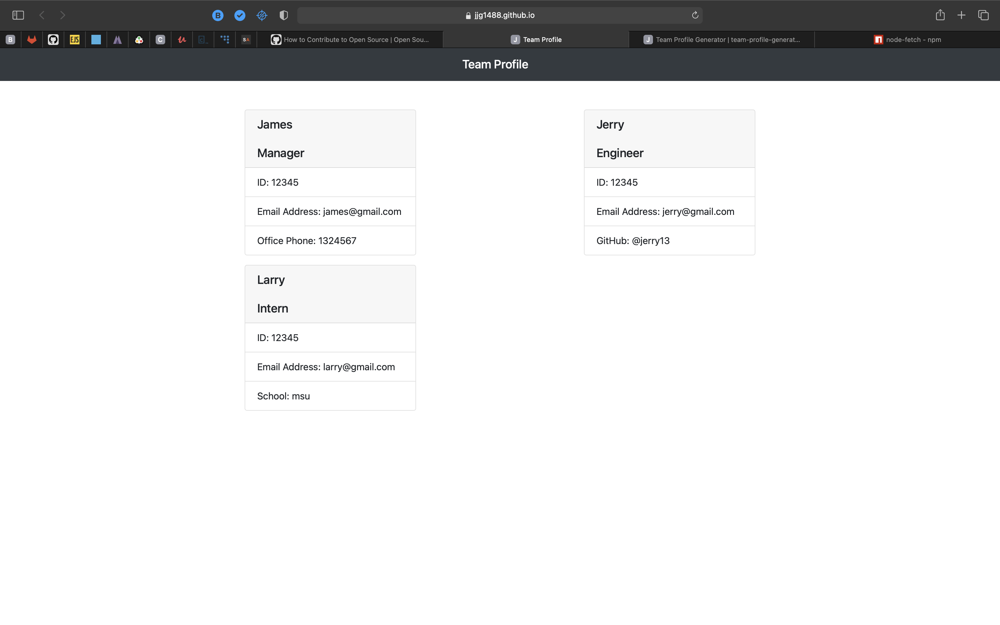

## Team Profile Generator

# Description

This application displays a command line application that takes in information about employees on a software engineering team and displays a webpage that has summaries for each person.

---

# Preview

![Link] (https://jjg1488.github.io/team-profile-generator/)

![Video] (https://drive.google.com/file/d/1a1Ox4cctp89tlPeOmlgL1lZV1-7hkrDv/view)

---

## Table of Contents

[Description of Application](#description)

[How to Install](#installation)

[How to Use](#usage)

[License Coverage](#license)

[How to Contribute](#contributing)

[How to Run Tests](#tests)

[Contact Information](#questions)
    
---

# Installation

Clone the repository, open the application in an IDE, npm init, then npm install app.js will launch the application once dependencies are installed.

---

 # Usage

Answer the prompts, the html page will be genereated automatically

---

# License

---
# Contributing

Contact me via email or github

---
# Tests

Once the dependencies are installed, npm run test will test the application

---

# Questions

jamesgault1488@gmail.com

@JJG1488

Contact me via github or by email